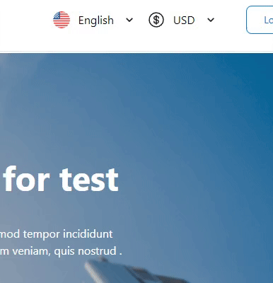

# v-click-outside
Vue directive to react on clicks outside an element without stopping the event propagation. Great for closing dialogues and menus among other things.

## Use

```js
import Vue from "vue"
import ClickOutside from "./outside-click.js";

const  app  =  createApp(App);

app.directive("click-outside",  ClickOutside);

app.mount("#app");
```
## Detecting Iframe Clicks

To our knowledge, there isn't an idiomatic way to detect a click on a `<iframe>` (`HTMLIFrameElement`).
Clicks on iframes moves `focus` to its contents’ `window` but don't `bubble` up to main `window`, therefore not triggering our `document.documentElement` listeners. On the other hand, the abovementioned `focus` event does trigger a `window.blur` event on main `window` that we use in conjunction with `document.activeElement` to detect if it came from an `<iframe>`, and execute the provided `handler`.

**As with any workaround, this also has its caveats:**

- Click outside will be triggered once on iframe. Subsequent clicks on iframe will not execute the handler **until focus has been moved back to main window** — as in by clicking anywhere outside the iframe. This is the "expected" behavior since, as mentioned before, by clicking the iframe focus will move to iframe contents — a different window, so subsequent clicks are inside its frame. There might be way to workaround this such as calling window.focus() at the end of the provided handler but that will break normal tab/focus flow;
- Moving focus to `iframe` via `keyboard` navigation also triggers `window.blur` consequently the handler - no workaround found ATM;

Because of these reasons, the detection mechanism is behind the `detectIframe` flag that you can optionally set to `false` if you find it conflicting with your use-case.
Any improvements or suggestions to this are welcomed.
## Example
</img>

## License

[MIT License](https://github.com/sohilpro/outside-clickq/main/LICENSE)
